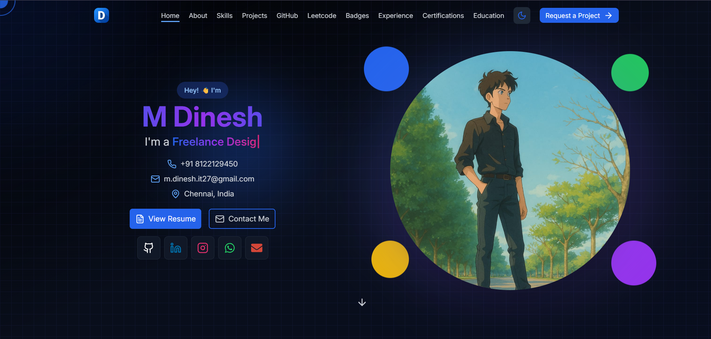
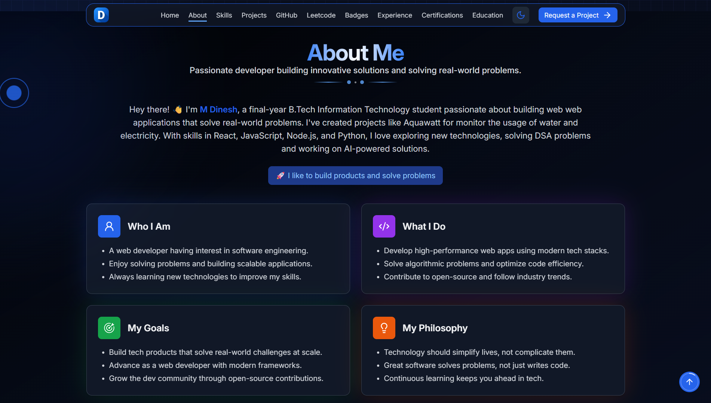
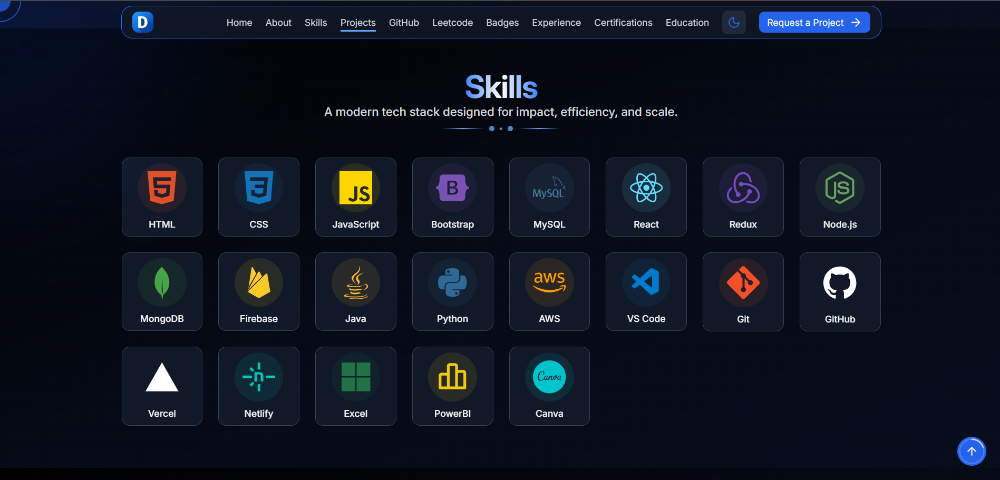
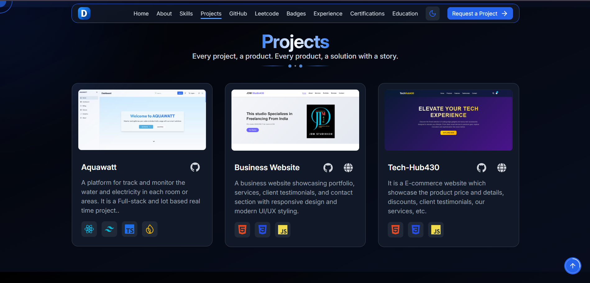
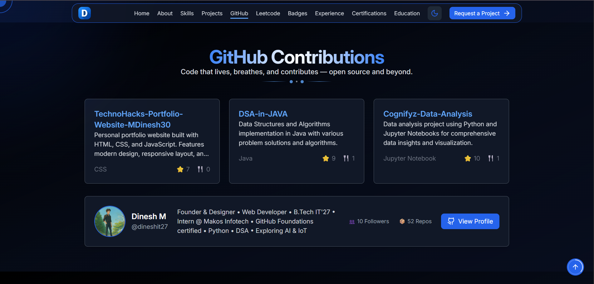
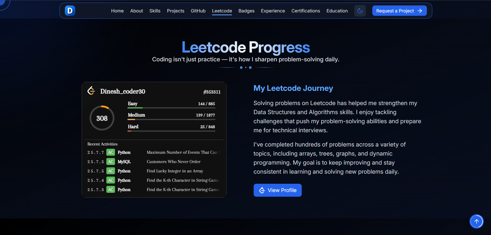
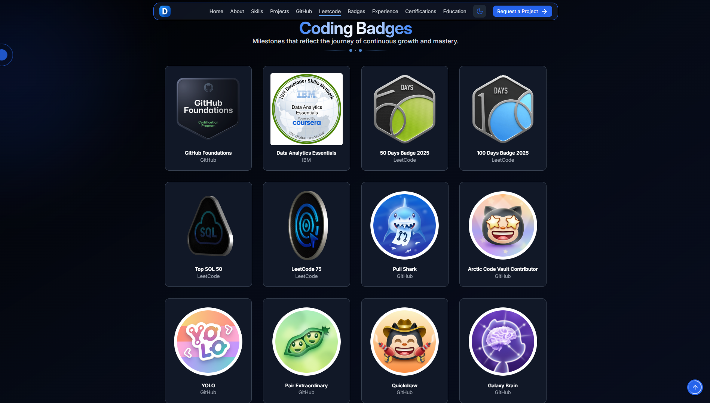
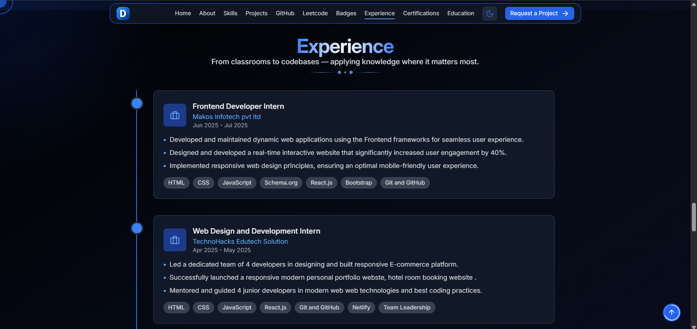
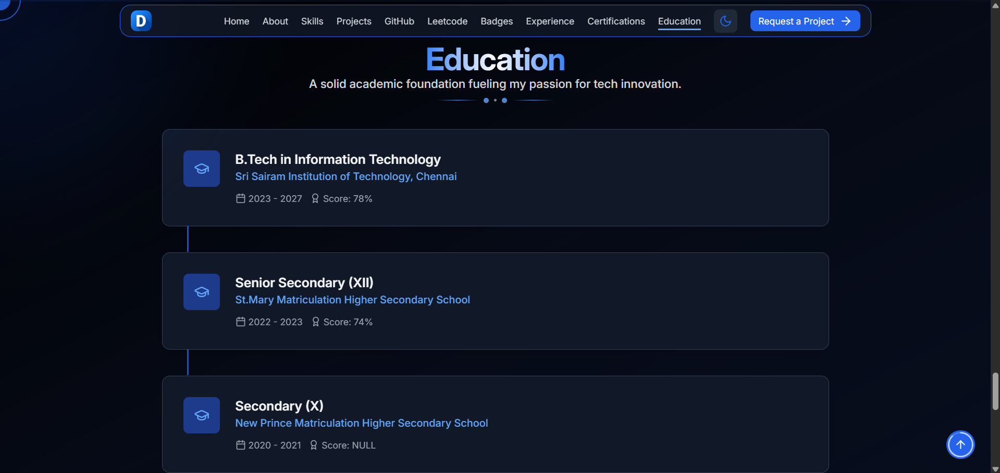
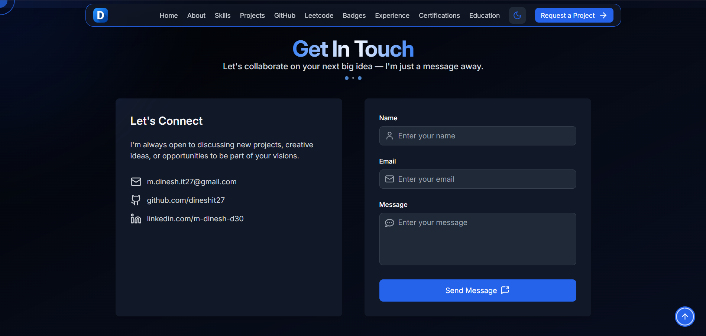

# Dinesh portfolio - Full Stack ✨
Welcome to my digital space! 🚀  
This is the repository for my personal portfolio website, showcasing my skills, projects, experience, education, certifications, and more. It’s built using React, TypeScript, Tailwind CSS, and other modern web technologies. It fetches data from various APIs to display the latest information, such as GitHub repositories, LeetCode submissions, and blogs. The portfolio is responsive, interactive, and optimized for performance.

## Live Demo 🌍

Explore the live version of my portfolio here:  
[](https://m-dinesh-30.web.app/)


## Key Features 🔑

- **Responsive Design**: The portfolio adjusts to all screen sizes, ensuring an optimal experience on both desktop and mobile devices.
- **Smooth Animations**: Interactive elements, hover effects, and smooth scrolling give the user a pleasant experience.
- **Dynamic Content**: Fetches data from various APIs to display the latest information, such as GitHub repositories, LeetCode submissions, and blogs.
- **Interactive Icons**: Utilizes Lucide icons for a modern and interactive design.
- **SVG Signature Animation**: Framer-Motion is used to animate the SVG signature on the loading page.
- **Dark Mode**: Built with dark mode support using a simple toggle to switch between light and dark themes.
- **Custom Sections**:
  - **Home**: Introduction, Typewriter effect with dynamic roles, and links to key sections.
  - **About**: A section that provides more insight into my background and skills.
  - **Skills**: Displays my technical skills, organized by categories.
  - **Projects**: Showcase of personal and professional projects.
  - **GitHub**: Fetches and displays my GitHub repositories with a link to view the profile.
  - **LeetCode**: Fetches and displays my LeetCode submissions.
  - **Badges**: Displays badges from various platforms like GitHub, LeetCode, and HackerRank.
  - **Experience**: Details about my work experience with a timeline layout.
  - **Education**: My academic journey including degree and institution.
  - **Certifications**: Certificates and courses completed with a link to verify.
  - **Contact**: A form to reach out to me directly.
- **SEO Optimized**: Ensures visibility on search engines.
- **Performance Optimized**: Optimized for fast loading with minimal web vitals.
  
## Tech Stack ⚙️

This portfolio is built with the following technologies:

| Technology       | Purpose                                                                 |
|------------------|-------------------------------------------------------------------------|
| **React**        | JavaScript library for building dynamic and interactive user interfaces. |
| **TypeScript**   | Typed JavaScript superset for enhanced code safety and tooling.         |
| **Tailwind CSS** | Utility-first CSS framework for rapid, responsive UI development.        |
| **Lucide Icons** | Lightweight and customizable SVG icons for modern design.               |
| **GitHub API**   | Fetches repository data to display projects dynamically.                |
| **Framer Motion**| Animation library for smooth, interactive UI effects (e.g., SVG animations). |
| **HTML**         | Standard markup for structuring web content.                            |
| **CSS**          | Styling language for designing visually appealing layouts.              |
| **Firebase**     | Backend services (auth, database, hosting) for seamless app deployment. |
| **Cursor IDE**   | AI-powered code editor for enhanced productivity and debugging.         |

## 📂 **Directory Structure**

```
├── 📁 .firebase/ 🚫 (auto-hidden)
├── 📁 .git/ 🚫 (auto-hidden)
├── 📁 .vscode/ 🚫 (auto-hidden)
├── 📁 Portfolio/
│   ├── 📁 .git/ 🚫 (auto-hidden)
│   ├── 📁 .github/
│   │   └── 📁 workflows/
│   ├── 📁 dist/ 🚫 (auto-hidden)
│   ├── 📁 node_modules/ 🚫 (auto-hidden)
│   ├── 📁 public/
│   │   ├── 📁 assets/
│   │   │   ├── 🖼️ 2nd event.jpg
│   │   │   ├── 🖼️ 3rd.jpg
│   │   │   ├── 🖼️ 4th.jpg
│   │   │   ├── 🖼️ 5th.jpg
│   │   │   ├── 🖼️ 6th.jpg
│   │   │   ├── 🖼️ AI.png
│   │   │   ├── 🖼️ aquawatt.png
│   │   │   ├── 🖼️ brain.png
│   │   │   ├── 🖼️ dinportf.png
│   │   │   ├── 📕 dresume.pdf
│   │   │   ├── 🖼️ favicon.png
│   │   │   ├── 🖼️ food.png
│   │   │   ├── 🖼️ gd.jpg
│   │   │   ├── 🖼️ hackathon.jpeg
│   │   │   ├── 🖼️ jdmweb.png
│   │   │   ├── 🖼️ p2.png
│   │   │   ├── 🖼️ profile.png
│   │   │   ├── 🖼️ techhub430.png
│   │   │   ├── 🖼️ uiux.jpg
│   │   │   └── 🖼️ web dev.jpg
│   │   └── 📄 robots.txt
│   ├── 📁 src/
│   │   ├── 📁 components/
│   │   │   ├── 📁 hero/
│   │   │   │   ├── 📄 ActionButtons.tsx
│   │   │   │   ├── 📄 ContactInfo.tsx
│   │   │   │   └── 📄 SocialLinks.tsx
│   │   │   ├── 📁 loading/
│   │   │   │   ├── 📄 HandwritingAnimation.tsx
│   │   │   │   ├── 📄 LoadingScreen.tsx
│   │   │   │   └── 📄 svgPaths.ts
│   │   │   ├── 📁 ui/
│   │   │   │   ├── 📄 AboutCard.tsx
│   │   │   │   ├── 📄 BlogCard.tsx
│   │   │   │   ├── 📄 CertificationCard.tsx
│   │   │   │   ├── 📄 ContactForm.tsx
│   │   │   │   ├── 📄 CustomCursor.tsx
│   │   │   │   ├── 📄 EducationCard.tsx
│   │   │   │   ├── 📄 ExperienceCard.tsx
│   │   │   │   ├── 📄 LeetCodeDataExtractor.tsx
│   │   │   │   ├── 📄 ProjectCard.tsx
│   │   │   │   ├── 📄 ScrollToTop.tsx
│   │   │   │   ├── 📄 SectionBackground.tsx
│   │   │   │   ├── 📄 SectionTitle.tsx
│   │   │   │   ├── 📄 SkillCard.tsx
│   │   │   │   ├── 📄 ThemeToggle.tsx
│   │   │   │   └── 📄 TypeWriter.tsx
│   │   │   ├── 📄 About.tsx
│   │   │   ├── 📄 Achievements.tsx
│   │   │   ├── 📄 Badges.tsx
│   │   │   ├── 📄 Blogs.tsx
│   │   │   ├── 📄 Certifications.tsx
│   │   │   ├── 📄 Contact.tsx
│   │   │   ├── 📄 Education.tsx
│   │   │   ├── 📄 Experience.tsx
│   │   │   ├── 📄 Footer.tsx
│   │   │   ├── 📄 GitHub.tsx
│   │   │   ├── 📄 Hero.tsx
│   │   │   ├── 📄 Leetcode.tsx
│   │   │   ├── 📄 Link.tsx
│   │   │   ├── 📄 Navbar.tsx
│   │   │   ├── 📄 Projects.tsx
│   │   │   ├── 📄 Services.tsx
│   │   │   └── 📄 Skills.tsx
│   │   ├── 📁 hooks/
│   │   │   ├── 📄 useAnimatedLogo.ts
│   │   │   ├── 📄 useBlogs.ts
│   │   │   ├── 📄 useLoading.ts
│   │   │   └── 📄 useTheme.ts
│   │   ├── 📄 App.tsx
│   │   ├── 🎨 index.css
│   │   ├── 📄 main.tsx
│   │   └── 📄 vite-env.d.ts
│   ├── 🚫 .gitignore
│   ├── 📜 LICENSE
│   ├── 📖 README.MD
│   ├── 📄 eslint.config.js
│   ├── 🌐 index.html
│   ├── 📄 package-lock.json
│   ├── 📄 package.json
│   ├── 📋 pglite-debug.log 🚫 (auto-hidden)
│   ├── 📄 postcss.config.js
│   ├── 📄 tailwind.config.js
│   ├── 📄 tsconfig.app.json
│   ├── 📄 tsconfig.json
│   ├── 📄 tsconfig.node.json
│   └── 📄 vite.config.ts
├── 📁 node_modules/ 🚫 (auto-hidden)
├── 📄 .firebaserc
├── 🚫 .gitignore
├── 📄 firebase.json
├── 📄 package-lock.json
├── 📄 package.json
├── 📋 pglite-debug.log 🚫 (auto-hidden)
└── 📋 vite-dev.log 🚫 (auto-hidden)
```

---

## 📸 Screenshots

Here’s a glimpse of the portfolio:



---


---


---


---


---


---


---


---


---


---

## Contributing 🤝

Contributions are welcome! If you’d like to improve this project or add features, feel free to:

1. Fork the repo.
2. Create a new branch.
3. Submit a pull request.

I appreciate all suggestions for enhancement! 🙏

## License 📄

This project is licensed under the MIT License - see the [LICENSE](LICENSE) file for details.

## Contact Me 📬

Let’s connect:

[](mailto:m.dinesh.it27@gmail.com)
[](https://www.linkedin.com/in/m-dinesh-d30/)
[](https://www.instagram.com/_dinx_pvt_430)
[](https://github.com/dineshit27)

Thanks for stopping by! 👋

---

> "Design is not just what it looks like and feels like. Design is how it works." – Steve Jobs

### 🔥 Made with ❤️ by **Dinesh**
